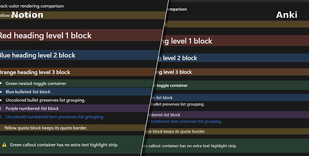

# Changelog

## 1.4.0 - 2026-07-25

> [!WARNING]
> **Parser and card template changes**
>
> This update expands cloze parsing and includes updated bundled card templates. On existing installations, Noteck skips the automatic startup sync once after upgrading to this version. Run a manual sync when convenient; it may take longer because cloze paragraphs and root toggles need to be reparsed. Normal automatic startup syncing resumes the next time Anki starts.

- Added advanced cloze parsing with multiple deletions: highlight text with different background colors in Notion, and each color becomes a separate cloze deletion. You can choose the recognized colors in **Settings** (by default only yellow is selected).
- Create a cloze card from a toggle by starting its title with `[cloze]` or `Cloze:`. Noteck uses the content inside the toggle for the card and ignores the toggle title.
- Add rich back-side details by nesting toggles titled `[extra]` or `Extra:` inside a cloze toggle. Their contents appear in the card's Extra section without becoming cloze deletions.
- Cloze-delete an entire paragraph, heading, list item, quote, callout, or toggle by applying one of your selected cloze colors to the whole block.
- Learn more about cloze parsing in sections 7 and 8 of the [Noteck documentation](https://noteck.notion.site/Documentation-30524ef63480806ea3fdf015a0fd7963?source=copy_link).
- After upgrading, open **Settings** → **Cards** and select **Update card templates** to install the new bundled cloze templates.

## 1.3.0 - 2026-07-14

> [!WARNING]
> **Parser and card template changes**
>
> This update introduces a new parser and updated card versions; See below for further details. Because all cards need to be reparsed, the first sync may take longer than usual, and automatic sync is disabled the first time you open this version so you can run it manually when convenient.

- Added support for Notion block colors in Anki cards, including foreground and background colors for paragraphs, headings, list items, quotes, callouts, and nested toggles.
- Top-level toggle colors are now reflected on the complete card surface or card title, matching the color used in Notion.
- After upgrading, open **Settings** → **Cards** and select **Update card templates** so the new colors are displayed on your Anki cards.
- Improved syncing for faster, more reliable updates.

## 1.2.0 - 2026-07-04

- Added dynamic page-selection behavior so selecting or deselecting a parent page now keeps its descendant pages in sync.

## 1.1.0 - 2026-07-04

- Preserved user-customized Noteck card template HTML and styling during normal startup and sync setup.
- Added a Settings action to restore default card templates when templates have been customized.
- Added card template version tracking so bundled template updates can be offered separately from restoring user edits.
- Added an update card templates action for older bundled template versions.
- Improved Settings action button focus handling after button clicks.

## 1.0.0 - 2026-02-12

- First public release.
- Added schema-driven Notion sync UI with tabs for Pages, Cards, Image Occlusion, and Settings.
- Added deterministic Notion -> Anki sync with card-type-aware mapping and content hashing.
- Added page-level default card-type overrides and toggle-level controls.
- Added Image Occlusion candidate workflow integration.
- Squashed database migrations into a single baseline migration for fresh installs.
